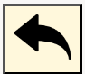

# Software Studio 2023 Spring
## Assignment 01 Web Canvas

## Announcements
This is a project of the 2023 Spring Software studio class in National Tsing Hua University.
The program is written by daisyliu0225.

## Scoring

| **Basic components**                             | **Score** | **Check** |
| :----------------------------------------------- | :-------: | :-------: |
| Basic control tools                              | 30%       | Y         |
| Text input                                       | 10%       | Y         |
| Cursor icon                                      | 10%       | Y         |
| Refresh button                                   | 5%        | Y         |

| **Advanced tools**                               | **Score** | **Check** |
| :----------------------------------------------- | :-------: | :-------: |
| Different brush shapes                           | 15%       | Y         |
| Un/Re-do button                                  | 10%       | Y         |
| Image tool                                       | 5%        | Y         |
| Download                                         | 5%        | Y         |

| **Other useful widgets**                         | **Score** | **Check** |
| :----------------------------------------------- | :-------: | :-------: |
| Other features                                   | 1~5%      | Y         |

---

## How to use
Panel
-
- This is the panel of the project. The white part on the left is the canvas. The yellow part is the settings and the tools we use to draw on canvas.
 

Tools
-
1. Cursor
   - When the user clicks on the cursor button, the cursor becomes a cursor and the canvas cannot do any editing. 
   - Cursor icon  
   - Cursor cursor   
2. Brush
   - When the user clicks on the brush button, the cursor becomes the brush and the user can draw on the canvas. 
   - Brush icon  
   - Brush cursor   
3. Eraser
   - When the user clicks on the eraser button, the cursor becomes an eraser and the user can erase things on canvas. 
   - Eraser icon  
   - Eraser cursor   
4. Special Brushes(Circle/Triangle/Square)
   - When the user clicks on the circle/triangle/square brush, the cursor becomes special cursors and the user can draw the shapes.
   - Circle
     - Circle icon  
     - Circle cursor   
   - Square
     - Square icon  
     - Square cursor   
   - Triangle
     - Triangle icon  
     - Triangle cursor   
5. Text
   - When the user clicks on the text button, the cursor besomes text and the user can input text.
   - Text icon  
   - Text cursor   
   
6. Reset
   - When the user clicks on the button, the user can reset the whole canvas. A small alert message shows.
   - Reset icon   
   
7. Upload/Download
   - Upload
     - When the user clicks on the upload button, the user can upload an image unto the canvas.
     - Upload icon  
   - Download
     - When the user clicks on the download button, the user can download the image on the canvas.
     - Download icon   
     
8. Redo/Undo
   - Redo
     - When the user clicks on the redo button, the user can redo canvas.
     - Redo icon  
   - Download
     - When the user clicks on the undo button, the user can undo canvas.
     - Undo icon   

Settings
-
1. Color Picker
   - When the user clicks on color picker, the user can choose color and change color to draw.
   - 
   - Usage
   - Before |
   - Change 
   - After 
 
2. Brush size

## Bonus Function description
1. Special brush -- Line
   - When click on the button, the user can draw a line on canvas.
   - 
2. Text input -- Stroke text
   - In addition to text style and text font, there is also a stroke text which can make the words hollow before user inputs text.
   - 

## Web page link

    your web page URL.

## Others (Optional)

I am so tired QQ.

---

## Versions
| Version | Date | Description |
|---|---|---|
|1|2024/03/22|html and css parts finished, probably get some cool features and beautify later|
|2|2024/03/23|upload to canvas successfully|
|3|2024/03/23|upload bug fix & reset finished|
|4|2024/03/23|download function finished|
|5|2024/03/24|Special brushes finished|
|6|2024/03/24|Text input finished|
|7|2024/03/25|Undo redo finished|
|8|2024/03/27|Addition functions finished|
